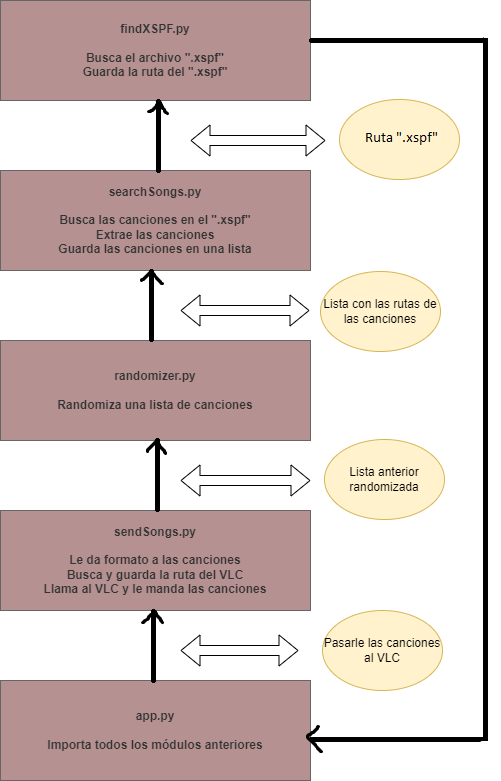
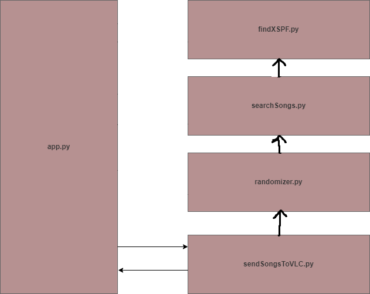
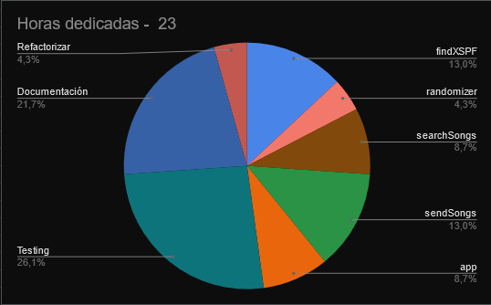

# Randomized-songs-in-VLC

## Índice

1. [Introducción](#introduccion)
2. [Manual](#manual)
3. [Metodología](#metodologia)
4. [Descripción Técnica](#descripcion-tecnica)
5. [Pruebas](#pruebas)
6. [Coverage](#coverage)
7. [Tiempo](#tiempo)
8. [Conclusión](#conclusion)
9. [Menciones](#menciones)

## Introducción

Este proyecto titulado "Randomized songs in VLC" ha sido creado por Amán Lama Vilariño de 1º de DAM del IES TEIS. Este proyecto consta en un programa que si le das un archivo ".xspf" del VLC, poniendolo en el lugar correspondiente, reproducirá de forma automática las canciones de dicho archivo.

Idea del proyecto compartida por [Dfleta](https://github.com/dfleta) (nuestro profesor).

## Manual

### Pre-requisitos

Para poder ejecutar este programa tendrás que tener instalado [VLC](https://www.videolan.org/vlc/download-windows.es.html), en la ruta "C:\Program Files\VideoLAN", entre otros aplicativos.

Otros requisitos fundamentales para poder compilar este programa son:

- [Python 3.12](https://www.python.org/downloads/)
- [VS Code](https://code.visualstudio.com/download) o otro interprete de lenguajes (aunque también sirve la terminal)

### Requisitos de desarrollo

En el caso de que nos introduzcamos más a fondo los requisitos para que el programa funcione correctamente y poder desarrollarlo con total tranquilidad están en el archivo "[requirements.txt](requirements.txt)". En este archivo se encontrarán todos los programas y versiones necesarios para poder modificar este repositorio, por otra parte si quieres visualizar el seguimiento de git tienes que descargar [Git 2.43](https://git-scm.com/downloads).

### Cómo se instala

Para instalar el programa hay que realizar los siguientes pasos:

1. Abrir la terminal

"Windows + R" y luego escribir "cmd"

2. Ir al escritorio

```bash
$ cd C:/Users/<nombre usuario>/Escritorio
```

3. Crear una carpeta

```bash
$ mkdir proyectoVLC
```

4. Ir al interior de la carpeta

```bash
$ cd proyectoVLC
```

5. Clonar el repositorio en la carpeta

```bash
$ git clone https://github.com/AmarinoLama/Randomized-songs-in-VLC.git
```

### Cómo se usa

Para usar el programa tienes que realizar los siguentes pasos:

1. Crear el xspf de las canciones

Abrir el VLC y mandarle la carpeta de canciones "C:\Users\\\<nombre usuario>\Desktop\proyectoVLC\Randomized-songs-in-VLC\canciones" 

Luego hacer "Ctrl + Y" y guardarlo en la propia carpeta del proyecto ("C:\Users\\\<nombre usuario>\Desktop\proyectoVLC\Randomized-songs-in-VLC") o en la carpeta de música ("C:\Users\\\<nombre usuario>\Music")

En el caso de que quieras usar otras canciones haz lo mismo pero en vez de mandar la carpeta de canciones mandas tu propia carpeta de canciones al VLC.

En cuanto a la ejecución del programa una vez realizado los anteriores pasos deberás hacer lo siguiente:

1. Abrir la terminal

"Windows + R" y luego escribir "cmd"

2. Ir al proyecto 

```bash
$ cd C:\Users\<nombre usuario>\Desktop\proyectoVLC\Randomized-songs-in-VLC
```

3. Ejecuta app.py

```bash
$ python app.py
```

Una vez realizado todos los pasos se debería abrir el VLC y reproducirse de forma automática las canciones de la carpeta en las tengas almacenadas.

## Metodología

Para ver el seguimiento de git del programa debes ejecutar los siguientes comandos en la terminal.

1. Inicializar la carpeta

```bash
$ git init
```

2. Mirar las ramas del árbol

```bash
$ git log --all --graph --decorate --oneline
```

Al ejecutarse el comando debería de verse de la siguiente forma:


    
>Si se observa el seguimiento de git en una copia del proyecto se verá de forma distinta a la imagen

A lo largo del desarrollo del programa, que se ha ido realizando mediante TDD, he usado dos ramas: main (también llamada origin) y la rama develop.

La rama main se ha ido usando en función de las mejoras que he ido implementando en el programa y algunas refactorizaciones. Por otra parte, la rama develop ha sido usada para cuando tenga que realizar cambios sobre commits anteriores, como por ejemplo implementar casos test para las funciones. 

En el desarrollo de este programa se han usado los "conventional commits", el cúal es el método moderno para crear los commits.

## Descripción Técnica

Las librerías que se han usado a lo largo de este proyecto son las siguientes:

- Librería "os"
- Librería "random"
- Librería "xml.etree.ElementTree"
- Librería "import subprocess"

Respecto a la funcionalidad del programa, la aplicación funciona con módulos se van ejecutando uno a uno para luego mandar los datos correctamente a la aplicación principal ("[app.py](app.py)"). Primero se ejecuta "[findXSPF.py](src/findXSPF.py)", este módulo se encarga de buscar el archivo ".xspf" que el usuario crea y almacenará la ruta de este archivo. En el caso de que no encuentre el archivo en ninguna ruta de las guardadas se devolverá un mensaje conforme no se ha encontrado.

En segundo lugar se ejecutará la función "[searchSongs.py](src/searchSongs.py)", este módulo extraerá las canciones del archivo ".xspf" que tiene la siguiente estructura de etiquetas: xml, playlist, tracklist, track y location. De cada etiqueta "location" dentro del ".xspf" se saca la ruta de la canción y se almacena en una lista llamada "songs".

De seguido se ejecutará el programa "[randomizer.py](src/randomizer.py)" el cúal a través de la lista generada por el programa anterior randomizará el contenido de la lista para que nunca sea el mismo.

A continuación, se ejecutará el programa "[sendSongsToVLC.py](src/sendSongsVLC.py)". Este módulo es uno de los más importantes, puesto que es el que mandará las canciones randomizadas al VLC.

Finalmente, esta la aplicación que es "[app.py](app.py)", está hará todos los módulos mencionados anteriormente de un paso, es decir, ejecutará todos los módulos al mismo tiempo.

Cabe destacar que se contemplan todas las posibles situaciones, quiere decir que en cualquier caso que no haya llegado una lista u otros casos similares como que en vez de una lista sea un string y vicebersa, el programa devolverá un None e informará del error en cuestión.

De seguido en las siguientes imágenes se pueden ver unos diagramas que explicarán la relación entre los módulos y la app y los datos que se van transmitiendo entre todos los módulos:

1. Foto del diagrama de arquitectura



2. Foto del diagrama de Componentes



### Arquitectura de la aplicación

La estructura de la aplicación, es decir el programa en sí, es la siguiente:

- Carpeta src

1. [findXSPF.py](src/findXSPF.py)
2. [randomizer.py](src/randomizer.py)
3. [searchSongs.py](src/searchSongs.py)
4. [sendSongsVLC.py](src/sendSongsVLC.py)

- Carpeta test

1. [test_findXSPF.py](test/test_findXSPF.py)
2. [test_randomizer.py](test/test_randomizer.py)
3. [test_searchSongs.py](test/test_searchSongs.py)
4. [test_sendSongsVLC.py](test/test_sendSongsVLC.py)

- Fuera de la carpeta 

1. [app.py](app.py)

### Datos usados

Para el programa se usa un archivo ".xspf", el cual es un archivo bastante fundamental ya que tiene mucha información de las canciones (entre lo más importante la ruta de las canciones),  este tiene la siguiente estructura:


## Pruebas

Una vez tengas todo instalado en tu programa puedes probar las siguientes situaciones:

- Tener el ".xspf" en la carpeta del proyecto

El programa detectará que el ".xspf" está en la propia carpeta y funcionará todo de forma correcta.

- Tener el ".xspf" en la carpeta de música

El programa detectará que el ".xspf" está en la carpeta de música y funcionará todo de forma correcta.

- No tener un ".xspf" en ningún sitio

El programa devolverá un None acompañado de un mensaje informando la situación sobre que no se encontró el fichero ".xspf".

- El ".xspf" no tiene rutas de canciones

El programa devolverá un None acompañado de un mensaje informando la situación sobre que no se encontraron canciones.

- Probar con otras carpetas de canciones

Este proyecto viene acompañado de una carpeta de canciones para que puedas compilar el programa, pero no estas obligado a usar esas canciones en específico y puedes poner las canciones que tú quieras.

## Coverage

En la carpeta "coverage_annotation" puedes ver por todas las líneas que pasa al ejecutarse este proyecto. Para generar este archivo han de ejecutarse los siguentes comandos en la terminal:

```bash
$ coverage run --source ./src -m pytest
```

Este comando generará una tabla con los porcentajes de las líneas que se ejecutan en cada módulo.

```bash
$ coverage annotate -d ./coverage_annotation
```

Este comando creará en la carpeta otra carpeta llamada "coverage_annotation" (ya explicada anteriormente), la cual tiene "!" para las líneas que no se ejecutan y ">" para las líneas que se ejecutan.

Por otra parte, está el archivo "[.coveragec](.coveragec)" el cúal sirve para que en el porcentaje del primer comando no se tengan en cuenta las líneas del '"if __name__ == "__main__:"'.

Ahora en la siguiente imagen se puede observar el porcentaje de líneas de código que se ejecutan al pasar todos los casos test:


Hay dos archivos los cuales no tienen el coverage al 100% debido que hay casos test que no se ejecután en casos específicos. Estos casos son los siguientes (los casos test particulares están indicados en los comentarios):

- [test_findXSPF](test/test_findXSPF.py), 

1. test_xspfInProyect : este caso test solo no da error cuando el ".xspf" está dentro del propio proyecto

2. test_outProyet : este caso test solo no da error cuando el ".xspf"  está la carpeta de música

3. test_xspfNotFound : este caso testo no da error cuando no se encuentra un ".xspf"

- [test_searchSongs](test/test_searchSongs.py)

1. test_noSongs : este caso test no da error cuando no se encuentra ninguna canción

## Tiempo

En la siguiente imagen se pueden ver la horas dedicadas a cada apartado en el proyecto:



La justificación de las horas puede verse clara en el apartado de "[Conclusión](#conclusion)", ya que ahí están las especificaciones de los problemas que tuve a lo largo del desarrollo del programa.

## Conclusión

### Mejoras

La creación de este programa me ha costado mucho al principio, pero al ir dedicandole horas poco a poco me ha resultado más sencillo. A pesar de que el programa compile es cierto que existen varias cosas que mejoraría y estas son:

- Mejoras en las ramas

Es cierto que he usado varias ramas pero no estaría mal usar más la rama secundaria (la de develop) y tener todo un poco más organizado

- Compatibilidad en más dispositivos

El programa solo sirve para cuando se ejecuta en Windows 10 Pro, es decir, se podría hacer mejoras en el programa para que se pueda usar otros sistemas operativos, así como Linux y MAC entre otros.

- Más libertad en la ubicación del ".xspf" 

También se podría mejorar el apartado del ".xspf", ya que este programa solo reconoce el archivo si está en la propia carpeta del proyecto o si está en la carpeta de música del propio dispositivo.

- Orden de canciones

Se podría implementar una función que te deje elegir el orden de las canciones, es decir, que te deje elegir una canción como primer puesto y el resto te lo randomize.

- Trabajar con rutas relativas

En todo el programa he trabajado con rutas absolutas y esto complica mucho la ejecución del programa, en cambio se podría usar rutas relativas (con la librería os) y facilitar mucho varias funciones (principalmente la de "[findXSPF](src/findXSPF.py)").

- Añadir diccionarios 

En el módulo "[randomizer](src/randomizer.py)" se podrían introducir diccionarios para mejorar la eficacia del programa y la rapidez de este mismo. Los diccionarios almacenarían la ruta de la canción y la posición en la que se le va mandar al VLC.

- Parar el programa cuando algo dea error

Durante la ejecución del programa se puede dan errores en algún momento dado y se devuelve un mensaje indicando el error junto a un None. El problema es que este none se va mandando al resto de archivos por lo que al final se acaban devolviendo varios nones y varios mensajes de error. Para solucionar esto se podría usar la librería sys para parar el programa.

- Manejo de excepciones

Es cierto que en el programa se contemplan varias precondiciones y postcondiciones pero estas son muy escasas, por lo que deberían de implementarse más para que el programa esté más completo.

- Casos test

Durante el desarrollo del programa se ha hecho TDD, por lo que se han ido implementando casos test para tanto como unitarios como de integración para las posibles situaciones durante la ejecución del programa. A pesar de usar ambos tipos de casos test, no he usado casos test unitarios en los módulos de "[searchSongs.py](src/searchSongs.py)" y "[sendSongsVLC.py](src/sendSongsVLC.py)". Es cierto que hay algún caso unitario pero estos son demasiado pobres, algunos casos test que debería implementar son estos (teniendo en cuenta de que tengo la ruta del ".xspf"):

```bash
# caso test para searchSongs.py

def test_existSongsMejorados():
    assert searchSongs(<ruta de la canción>) == None
    assert isinstance(searchSongs(<ruta de la canción>, list)
    assert len(searchSongs(<ruta de la canción>) > 1
    assert searchSongs(<ruta de la canción>) is not []
```

```bash
# caso test para sendSongs.py

def test_songsSended():
    assert (sendSongsVLC(["cancion1", "cancion2", "cancion3"])) == "Ha funcionado"
    assert (sendSongsVLC(["sdjoasdj", "asdasd", "dfgdf"])) == "Ha funcionado"
    assert (sendSongsVLC(["sdjoasdj", "asdasd", "dfgdf", "sdjoasdj", "sdjoasdj", "sdjoasdj", "sdjoasdj","sdjoasdj", "sdjoasdj", "sdjoasdj", "sdjoasdj", "sdjoasdj", "sdjoasdj", "sdjoasdj", "sdjoasdj", "sdjoasdj"])) == "Ha funcionado"
```

- .gitignore

En la carpeta del proyecto se incluye un archivo "[.gitignore](.gitignore)" a pesar de que toda la información está correcta hay un montón de versiones que no son necesarias por lo que deberían suprimirse en versiones futuras del programa.

### Dificultades

Personalmente he encontrado bastantes dificultades a lo largo del proyecto y estas fueron las siguientes:

- Librería os

Para mi esta librería es nueva por lo que hay diversas funcionalidades que no conocía y hubiese estado bien conocerlas.

- Acceso a XML

En la parte de acceso de datos al XML no he entendido mucha cosa por lo que me he centrado en seguir los apuntes de acceso a datos y información de la librería "ElementTree" y programar sin saber muy bien lo que estaba haciendo.

- Hacer el programa modular

He tenido un par de dificultades a la hora de hacer el programa modular, pero a la hora de consultar ejercicios hechos anteriormente se resolvieron todos mis problemas.

- Casos test

Los casos test de los módulos de "[findXSPF](src/findXSPF.py)" y "[sendSongsToVLC.py](src/sendSongsVLC.py)" me han dado muchos problemas, puesto a que no encontraba los casos adecuados para que funcionase todo a la perfección.

### Opinión personal

En mi más sincera opinión este proyecto me ha parecido un reto bastante interesante, es cierto que va más allá de las cosas que dimos en clase (al ser un proyecto que dependía de otras asignaturas) pero con paciencia he sido capaz de acabarlo. Por otra parte creo que hubiese estado bien haber empezado el proyecto con más tiempo, debido a que los últimos días me he visto un poco apretado con la documentación. 

## Menciones

Este proyecto se ha podido realizar gracias a las siguientes personas:

- [Dfleta](https://github.com/dfleta) (nuestro profesor)
- Victor (compañero de clase)
- [Missing Semester](https://www.youtube.com/@MissingSemester) (canal de youtube)
- [makigas](https://www.youtube.com/@makigas)(canal de youtube)
- [Software Development](https://www.youtube.com/@programming5393)(canal de youtube)